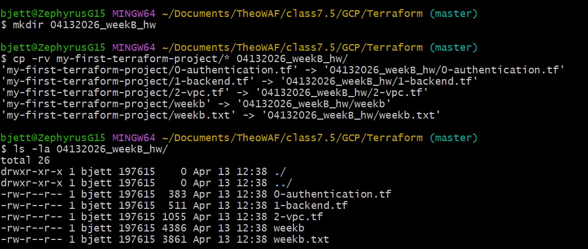
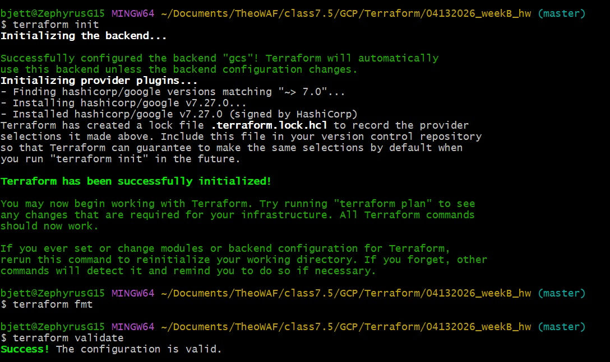
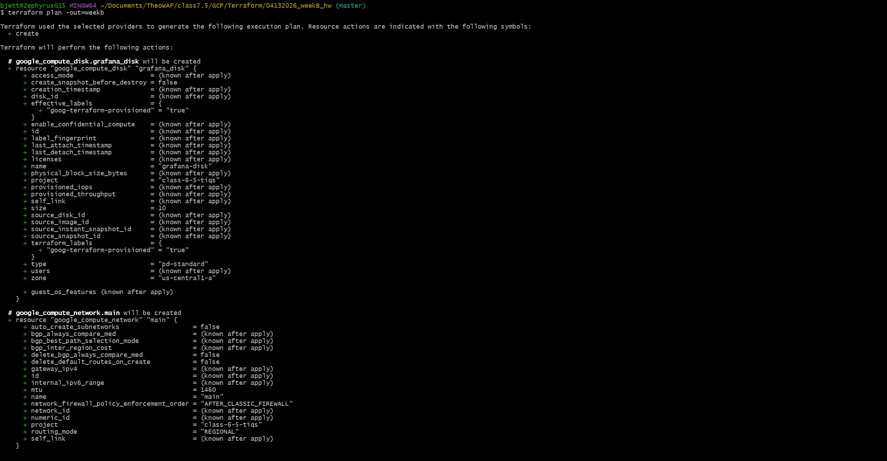
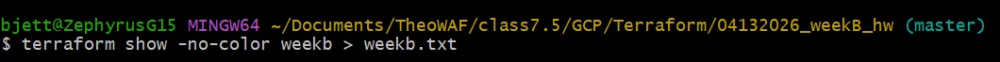
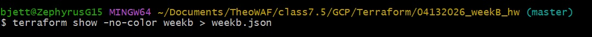
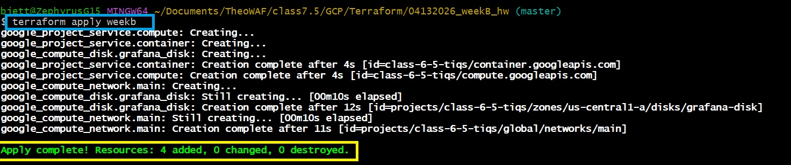
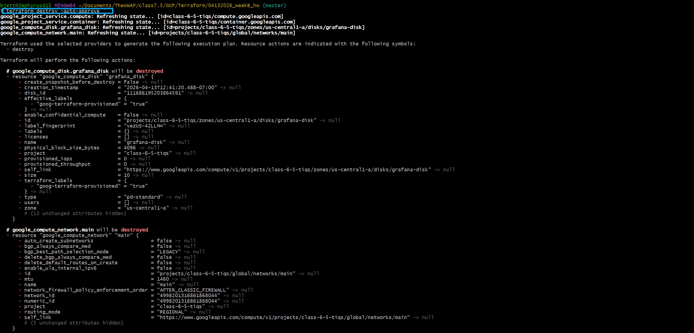
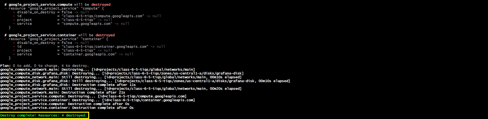

# 🚀 **TheoU 7.5 – Be A Man Week B Homework**


---

## 📌 **Project Overview**

This project demonstrates the use of **Terraform Infrastructure as Code (IaC)** to generate and export a Terraform execution plan, organize artifacts, and publish results to a GitHub repository.

The workflow emphasizes:

- Terraform plan generation
- Artifact management
- Git-based version control
- Portfolio-ready documentation and screenshots

---

## 📁 **Project Structure**

```text
04132026_WEEKB_HW/
├── git-screenshots/
|   ├── git-banner.png
|   ├── killercoda-git-overview.jpg
|   ├── lesson1.jpg
|   ├── lesson2-pt1.jpg
|   ├── lesson2-pt2.jpg
|   ├── lesson3-pt1.jpg
|   ├── lesson3-pt2.jpg
|   ├── lesson4-pt1.jpg
|   ├── lesson4-pt2.jpg
|   ├── lesson4-pt3.jpg
|   ├── lesson4-pt4.jpg
|   ├── lesson5.jpg
|   ├── lesson6-pt1.jpg
|   ├── lesson6-pt2.jpg
|   ├── lesson7.jpg
|   ├── lesson8-pt1.jpg
|   ├── lesson8-pt2.jpg
|   ├── lesson9.jpg
|   ├── lesson11-pt1.jpg
|   ├── lesson11-pt2.jpg
|   ├── lesson12-pt1.jpg
|   ├── lesson12-pt2.jpg
|   ├── lesson12-pt3.jpg
|   ├── lesson13-pt1.jpg
|   ├── lesson13-pt2.jpg
|   ├── lesson13-pt3.jpg
|   ├── lesson14-pt1.jpg
|   ├── lesson14-pt2.jpg
|   └── README.md
|
├── images/
├── linux-screenshots/
├── 0-authentication.tf
├── 1-backend.tf
├── 2-vpc.tf
├── A-GIT.md
├── B-LINUX.md
└── README.md
```

---

## ⚙️ **Deployment Steps**

### 1. **Create Assignment Folder**

```bash
mkdir <insertDateHere>_weekB_hw
cp -rv my-first-terraform-project/* <insertDateHere>_weekB_hw/
ls -la <insertDateHere>_weekB_hw/
```



### 2. **Initialize, Format, and Validate Terraform**

```bash
terraform init
terraform fmt
terraform validate
```



### 3. **Generate Terraform Plan**

```bash
terraform plan -out=weekb
```



### 4. **Export Terraform Plan Output**

#### Option A (Readable Format)

```bash
terraform show -no-color weekb > weekb.txt
```



#### Option B (JSON Format – Preferred for Automation)

```bash
terraform show -json weekb > weekb.json
```



### 5. **Terraform Apply**

```bash
terraform apply weekb
```



### 6. **Terraform Destroy**

```bash
terraform destroy -auto-approve
```




### 7. **Initialize Git Repository**

```bash
git init
git add .
git commit -m "initial commit"
```

### 8. **Connect to GitHub Repository**

> ⚠️ Repository naming requirement:

```bash
TheoU_7.5_BaM_weekB_<yourIdentifier>
```

```bash
git remote add origin https://github.com/tiqsclass6/TheoU_7.5_BaM_weekB.git
git branch -M main
git push -u origin main
```

---

## 📸 **Required Deliverables**

- 📂 [**GIT Screenshots (Markdown)**](A-GIT.md)
- 📂 [**LINUX Screenshots (Markdown)**](B-LINUX.md)
- 📝 [**View WeekB (TXT Format)**](/images/weekb.txt)
- 📝 [**View WeekB (JSON Format)**](/images/weekb.json)

---

## 🧪 **Validation Checklist**

| **Task**                               | **Status** |
| -------------------------------------- | ---------- |
| **Terraform initialized**              | ✅         |
| **Terraform plan generated**           | ✅         |
| **Plan exported to file**              | ✅         |
| **Folder created with correct naming** | ✅         |
| **File moved into folder**             | ✅         |
| **Git repo initialized**               | ✅         |
| **Code pushed to GitHub**              | ✅         |
| **Screenshots captured**               | ✅         |

---

## 🧠 **Key Concepts Demonstrated**

- Infrastructure as Code (IaC)
- Terraform execution planning
- Artifact generation and storage
- Git workflow (init, commit, push)
- Repository structuring for portfolio presentation

---

## ⚠️ **Notes**

- Ensure your Terraform files (`*.tf`) are valid before running `terraform plan`
- Always verify your GitHub repository name meets assignment requirements
- JSON output is recommended for advanced use cases (CI/CD, automation)

---

## 👥 **Authors**

- **Author:** *T.I.Q.S. DevSecOps*
- **Lab Team Lead:** *John Sweeney*
- [**GitHub Profile**](https://github.com/tiqsclass6)
